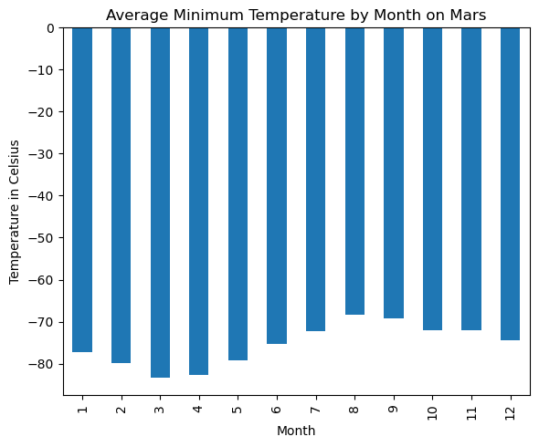
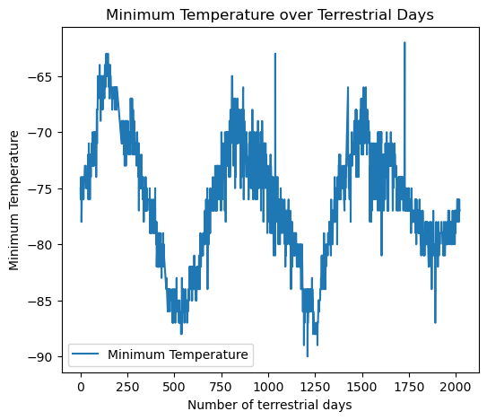

# Mars Data Exploration Project

## Overview

This project focuses on scraping Mars-related data from two different web sources using Python with libraries such as Splinter and BeautifulSoup. The first part involves scraping news articles, and the second part involves scraping temperature and atmospheric data from Mars. The data is then analyzed to find insights about Martian months, temperatures, and atmospheric conditions.

## Setup and Installation

Before running the project, make sure to install the required libraries. You can install these using the command:

```bash
pip install pandas matplotlib splinter beautifulsoup4
```
## Project Structure

```plaintext
Mars-Data-Exploration-Project/
│
├── data/                          # Data storage
│   ├── mars_news_data.json        # Scraped Mars news in JSON format
│   └── mars_data.csv              # Scraped Mars temperature and pressure data
│
├── notebooks/                     # Jupyter notebooks for exploration and presentation
│   ├── Part_1_Mars_News.ipynb     # Notebook for scraping Mars news
│   └── Part_2_Mars_Weather.ipynb  # Notebook for scraping Mars weather data
```

### Prerequisites

Before setting up the project, ensure you have the following installed:

1. **Python**: Version 3.8 or higher is recommended. Download and install from [the official Python website](https://www.python.org/downloads/).

2. **pip**: Python's package installer, which should come with your Python installation.

3. **Web Browser**: A modern web browser like Google Chrome.

4. **ChromeDriver**: Necessary for automated web interactions using Splinter. Download ChromeDriver matching your Chrome version from [its official site](https://sites.google.com/a/chromium.org/chromedriver/downloads).

5. **Jupyter Notebook**: For running and interacting with data analysis notebooks.
   ```bash
   pip install notebook
   ```

### Clone the Repository

Start by cloning the repository to your local machine:

```bash
git clone https://github.com/NataliiaShevchenko620/webscraping-challenge.git
cd webscraping-challenge
```

## Requirements

## Installing Dependencies

Before running the MarsAnalysis project, you need to install the Python libraries that the project depends on. These libraries and their specific versions are listed in the `Requirements.txt` file to ensure compatibility.

To install these dependencies, follow these steps:

1. Open your command line interface (CLI).

2. Navigate to the directory where the `Requirements.txt` file is located. It is the root directory of the project.

   ```bash
   cd path/to/MarsAnalysis

## Usage

# MarsAnalysis Project

## Usage

This section provides detailed steps on how to use the MarsAnalysis project to scrape and analyze data about Mars, including both news articles and meteorological data. Here are the steps you need to follow:

### Running the Notebooks

1. **Start Jupyter Notebook**:
   - After installing all necessary dependencies and setting up the project, launch Jupyter Notebook from your terminal by running:
     ```bash
     jupyter notebook
     ```
   - This command will start the Jupyter Notebook server and should open a browser window with a list of files in the directory from which it was started.

2. **Navigate to the Notebook Directory**:
   - In the Jupyter interface, navigate to the `notebooks/` directory which contains all the project notebooks.
   - You will find the following notebooks:
     - `Part_1_Mars_News.ipynb`: This notebook contains the script for scraping Mars news data.
     - `Part_2_Mars_Weather.ipynb`: This notebook focuses on scraping and analyzing Mars weather data.

3. **Open a Notebook**:
   - Click on the notebook file you wish to run.

### Understanding the Output

- Each notebook is annotated with comments and markdown cells that explain the purpose of each step.
- Outputs from cells (e.g., data tables, plots) will appear directly below the cells as they are executed.
- You can modify parameters or code to tweak data scraping criteria or analysis methods and re-run the cells to see different results.

#### Average Minimum Temperature by Month on Mars


#### Minimum Temperature over Terrestrial Days



By following these instructions, users can maximize the effectiveness of the MarsAnalysis project for both educational and research purposes.

This section of your `README.md` will guide users through the process of running the Jupyter notebooks included in the MarsAnalysis project, helping them understand how to interact with the project's tools and data effectively.

### Examples

# MarsAnalysis Project

## Examples

This section provides practical examples to help you understand how to use the MarsAnalysis project to perform specific tasks related to Mars data exploration. These examples assume that you have followed the setup and usage instructions and have the project running on your local machine.

### Example 1: Scraping Mars News

**Objective**: Retrieve the latest news about Mars from the designated web source.

**Steps**:
1. Open the `Part_1_Mars_News.ipynb` notebook in Jupyter.
2. Run all cells in the notebook. The cells perform the following actions:
   - Access the Mars news website.
   - Scrape news titles and preview texts.
   - Display the scraped news items in a structured format.

**Expected Output**:
- A list of dictionaries, each representing a news article with `title` and `preview` text.

### Example 2: Analyzing Mars Weather Data

**Objective**: Analyze temperature data to determine the average temperature for the current Martian month.

**Steps**:
1. Open the `Part_2_Mars_Weather.ipynb` notebook in Jupyter.
2. Execute the notebook cells which will:
   - Connect to the Mars weather data source.
   - Extract temperature data.
   - Calculate and display the average temperature.

**Expected Output**:
- A plot showing the daily temperature trends and the average temperature for the month.

### Example 3: Exporting Data

**Objective**: Save the scraped Mars weather data to a CSV file for offline analysis.

**Steps**:
1. Locate the cell in the `Part_2_Mars_Weather.ipynb` notebook that contains the `to_csv()` method.
2. Ensure the cell includes the correct path where you want to save the file.
3. Run the cell to execute the data export.

**Expected Output**:
- A CSV file named `mars_weather_data.csv` saved to the specified location.


## License

This project is licensed under the MIT License - see the [LICENSE](LICENSE) file for details.


